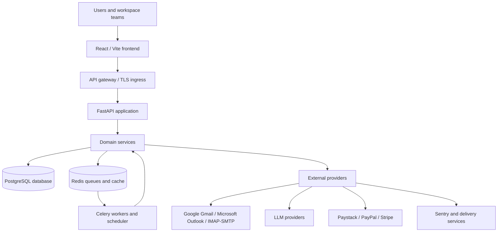

# Architecture

## Executive summary

The product is a modular email-intelligence SaaS. A React client calls a versioned FastAPI API; domain services coordinate synchronous and background work; PostgreSQL stores durable business state; provider adapters isolate email, AI, payment and delivery systems. Redis supports Celery queues and results. The backend image runs the API, workers, scheduler and bootstrap job with different commands.

## System context

This preserves the primary flow—Frontend → API Gateway → FastAPI → Services → Database → External Providers—while showing the asynchronous production path.

## Runtime components

| Component | Responsibility | Scale boundary |
|---|---|---|
| React/Vite frontend | Inbox, workflows, billing, admin and intelligence UX | Static assets or independent web containers |
| FastAPI API | Authentication, validation, orchestration, REST/WebSocket endpoints | Stateless API replicas behind ingress |
| Domain services | Email sync, AI, billing, campaigns, workflows and abuse controls | Provider-isolated modules |
| Celery worker | Long-running email, AI, campaign and maintenance tasks | Queue-specific worker replicas |
| Celery Beat | Periodic scheduling | Single active scheduler |
| PostgreSQL | Transactional system of record | Managed database with backups/replicas |
| Redis | Broker, task results and ephemeral coordination | Managed Redis |

## Code boundaries

- `frontend/src/components` contains feature modules; `services/api.js` is the HTTP boundary.
- `backend/app/api` owns transport and Pydantic contracts.
- `backend/app/services` owns business rules and provider orchestration.
- `backend/app/tasks` owns asynchronous execution and scheduling.
- `backend/app/models` owns SQLAlchemy persistence models.
- `backend/app/core` owns configuration, security, observability and router loading.

Provider details stay behind services, allowing an acquirer to replace email, LLM, payment, hosting or monitoring vendors without redesigning the API. Request IDs propagate through JSON logs, Sentry captures configured exceptions, and queues isolate long work from API latency.

## Architectural decisions

- API routes are versioned under `/api/v1`; operational and documentation endpoints remain at root.
- Pydantic validates request bodies and secure models reject unknown fields.
- Lockfiles drive reproducible builds.
- The backend container runs as non-root.
- Mock mode and SQLite enable deterministic tests; PostgreSQL and Redis are the production topology.
