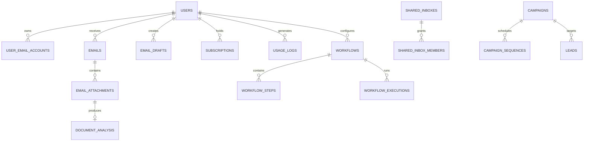

# Database

## Overview

PostgreSQL is the production system of record, accessed asynchronously through SQLAlchemy and `asyncpg`. SQLite with `aiosqlite` supports isolated tests. Redis is not a second system of record; it provides Celery brokerage, results and ephemeral coordination.

## Logical data domains

| Domain | Representative tables | Purpose |
|---|---|---|
| Identity | `users`, `user_email_accounts`, `email_provider_configs` | Accounts and encrypted provider configuration |
| Inbox | `emails`, `email_attachments`, `document_analysis`, `sync_history` | Messages, ingestion and attachment intelligence |
| Productivity | `email_drafts`, `prompt_templates`, `commitments`, `risks`, `opportunities`, `email_tasks` | Drafting, decisions and tasks |
| Automation | `agents`, `agent_memory`, `workflows`, `workflow_steps`, `workflow_executions`, `auto_reply_rules` | Configurable automation and execution history |
| Collaboration | `shared_inboxes`, `shared_inbox_members`, `contacts`, `companies` | Team inboxes and relationship intelligence |
| Revenue | `subscriptions`, `payments`, `credit_transactions`, `usage_logs`, `monthly_billing_snapshots` | Entitlements, payments and usage evidence |
| Growth | `campaigns`, `campaign_sequences`, `leads`, `hosted_email_send_logs` | Campaign and hosted-email operations |
| Governance | `llm_provider_configs`, `knowledge_entries`, `email_security_scans`, `persona_profiles` | AI configuration, knowledge and safety records |

## Relationship view

The SQLAlchemy models and migrations are authoritative for columns and constraints.

## Lifecycle and resilience

- Alembic revisions live in `backend/alembic/versions`.
- Compose uses an `init_db` job before API/worker startup.
- Prefer additive, backward-compatible migrations and forward fixes after data-changing releases.
- Production should use point-in-time recovery, encrypted backups and regularly tested restores.
- Attachment storage requires an independent backup and retention policy.
- Customer deletion must cover messages, attachments, logs, sync history and derived AI data.
