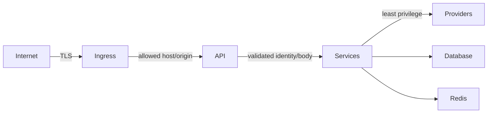

# Security

## Implemented controls

| Area | Control |
|---|---|
| Authentication | Signed JWTs, bcrypt/passlib password hashing and active-account checks |
| Input | Pydantic types/bounds, email validation, unknown-field and null-byte rejection |
| Network | Explicit CORS, restricted headers/methods, trusted hosts and SlowAPI rate limiting |
| Secrets | Environment configuration, encrypted stored credentials and startup validation |
| Authorization | User dependencies, admin checks, shared-inbox permissions and entitlements |
| Content | HTML/email sanitization, abuse scoring and attachment validation |
| Observability | JSON logs, correlation IDs and optional Sentry without default PII |
| Supply chain | Python/npm locks, three-ecosystem Dependabot, audits and Bandit |
| Runtime | Non-root backend container, health checks and service networks |

## Trust boundaries

## Production checklist

- Store unique `SECRET_KEY` and `ENCRYPTION_KEY` values in a secret manager.
- Set exact `ALLOWED_ORIGINS` and `TRUSTED_HOSTS`; avoid broad wildcards.
- Terminate TLS at managed ingress and enforce HTTPS/HSTS there.
- Configure Sentry sampling in line with the customer-data policy.
- Rotate OAuth, payment, SMTP and LLM credentials and minimize scopes.
- Use private database/Redis networking, TLS where supported and tested backups.
- Disable debug, mock and public-signup features unless explicitly required.
- Protect GitHub environments and require quality checks for releases.

SlowAPI uses process-local storage by default. Multi-replica production should configure Redis-backed limiter storage for consistent quotas.

## Vulnerability reporting

Report exploitable findings privately to the repository owner with reproduction and impact. Never include real customer data or credentials in an issue.
